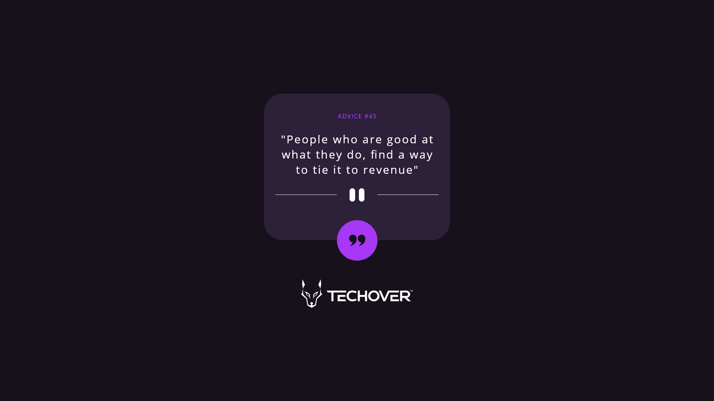

## Projekt 🌟

## Utmaningen 🐺

Din utmaning är att bygga denna Motivationsgenerator med hjälp av  och få den att se så likadan ut som möjligt som designen.

Du kan använda vilka verktyg du vill för att hjälpa dig att slutföra utmaningen. Så om du har något du vill öva på, känn dig fri att göra det.
Ex. React, Tailwind, Typescript 🔥

Dina användare bör kunna: ✅

- Visa optimal layout för appen beroende på deras enhets skärmstorlek
- Se hover states för alla interaktiva element på sidan
- Generera ett nytt råd genom att klicka på quote ikonen

TIPS : Börja med struktur med hjälp av Html & Css innan du börjar med Javscripten.

## Steg-För-Steg Guide. 🌟

1. Starta med att skapa strukturen för kortet och få in alla ikoner, knappar och bilder.

2. Använd Css för att få allt på plats (Använd text du har skrivit själv för att se hur det ser ut när du väll får text från API:et)

3. Lägg in alla färger på rätt plats enligt designen.

4. Skapa en funktion som hämtar API:et. Innanför den funktionen skapa logik som gör att du kan skicka informationen du får in av API:et till din HTML.

## Vart hittar du allting?

Din uppgift är att bygga projektet enligt designerna som finns i `/design` mappen. Du hittar både en mobil- och en skrivbordsversion av designen.

Designerna är i PNG-format.

Alla nödvändiga tillgångar finns i `/images` mappen. Tillgångarna är redan optimerade.

Det finns också en fil `style-guide.md` som innehåller den information du behöver, till exempel färgpalett och typsnitt.

**Lycka till!** 🐺
# motivationsGenerator
